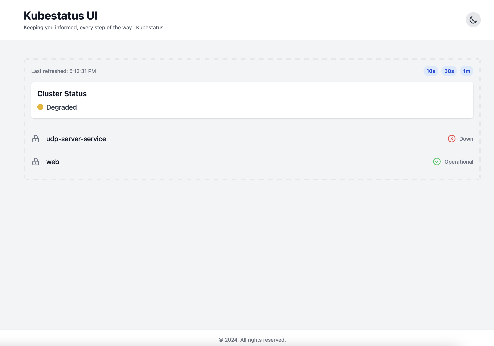

# kubestatus-operator


## Description




Kubestatus is an free and open-source tool to easily add status page to your Kubernetes cluster that currently display the status (operational, degraded or DOWN) of services.It is written in Go and uses the Kubernetes API to fetch information about the clusters and resources checck the [kubestatus-operand](https://github.com/soub4i/kubestatus-operand) image.

The tool provides a simple and convenient way to view the current state of your cluster and resources without having to use the kubectl command-line tool or the Kubernetes dashboard and in the same time give you a costumer friendly page that can be used as you main status page.

Features:

- ⚡ Lightweight
- 🔧 Minimal configuration
- 📖 Open-source
- 📫 Support TCP and UDP services


## Prerequisites

Before installing the KubeStatus Operator, ensure you have:

- Kubernetes cluster version 1.19+
- kubectl installed and configured
- Cluster admin access or appropriate RBAC permissions

## Installation

### Quick Install

You can install the KubeStatus Operator using the following command:

```bash
kubectl apply -f https://raw.githubusercontent.com/soubai/kubestatus-operator/main/dist/install.yaml
```


### Manual Installation

1. Clone the repository:
```bash
git clone https://github.com/soubai/kubestatus-operator.git
cd kubestatus-operator
```

2. Install the CRDs:
```bash
kubectl apply -f config/crd/bases
```

3. Install the operator:
```bash
kubectl apply -f dist/install.yaml
```

### Verify Installation

1. Check if the operator pod is running:
```bash
kubectl get pods -n kubestatus-operator-system
```

2. Verify the CRDs are installed:
```bash
kubectl get crds | grep kubestatus
```

## Usage

1. Create a KubeStatus resource:

```yaml
apiVersion: crd.soubai.me/v1
kind: KubeStatus
metadata:
  name: sample-kubestatus
spec:
  # Add your spec configuration here
```

2. Apply the resource:
```bash
kubectl apply -f kubestatus-sample.yaml
```

3. Check the status:
```bash
kubectl get kubestatus sample-kubestatus -o yaml
```

## Configuration

### Custom Resource Fields

| Field | Type | Description | Required |
|-------|------|-------------|-----------|
| `spec.Namespaces` | []string | List of namesp | Yes |
| `spec.Size` | integer | Number of replicas of Kubestatus (default `3`) | No |
| `spec.ConfigMapName` | string | ConfigMap name used by Kubestatus (default `kubestatus-configmap`) | No |

### Example Configuration

```yaml
apiVersion: crd.soubai.me/v1
kind: KubeStatus
metadata:
  name: dub-cluster12-status
spec:
  namespaces: 
    - default
    - web-namepace
  Size: 1
```

### Service annotation

To monitor your services with KubeStatus, you need to add them to the watch list. You can do this by adding a specific annotation to each service you want to monitor:

```sh
kubectl annotate svc my-service-name kubestatus/watch='true'
```

### Example 

You created this web application based on nginx image.

```sh
cat <<EOF | kubectl apply -f -
apiVersion: apps/v1
kind: Deployment
metadata:
  name: nginx-deployment
spec:
  selector:
    matchLabels:
      app: nginx
  replicas: 1
  template:
    metadata:
      labels:
        app: nginx
    spec:
      containers:
      - name: nginx
        image: nginx:1.14.2
        ports:
        - containerPort: 80
EOF
```

Exposing the web application using k8s service

```sh
cat <<EOF | kubectl apply -f -
apiVersion: v1
kind: Service
metadata:
  name: web-service
spec:
  selector:
    app: nginx
  ports:
  - port: 80
EOF
```

Add annotation to `web-service`:

```sh
kubectl annotate svc web-service kubestatus/watch='true'
```


In order to visit kubestatus status page you can `port-forword` the Kubestatus service:

```sh
kubectl port-forward service/kubestatus-service 8080 -n kubestatus
```

🚀 Now navigate to http://localhost:8080 


## Troubleshooting

### Common Issues

1. Operator pod not starting:
   - Check the pod logs:
   ```bash
   kubectl logs -n kubestatus-operator-system deployment/kubestatus-operator-controller-manager -c manager
   ```
   - Verify RBAC permissions

2. Status not updating:
   - Check the operator logs for errors
   - Verify the KubeStatus resource is properly configured

### Getting Support

If you encounter any issues:
- Open an issue on GitHub
- Check existing issues for solutions
- Include operator logs and resource definitions when reporting problems

## Uninstallation

To remove the KubeStatus Operator from your cluster:

```bash
kubectl delete -f dist/install.yaml
kubectl delete -f config/crd/bases
```

## Contributing

Contributions are welcome! Please feel free to submit a Pull Request.

## License

This project is licensed under the [Apache License 2.0](LICENSE).


